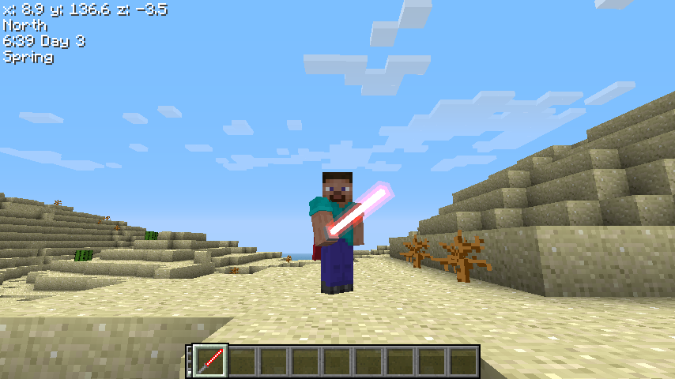
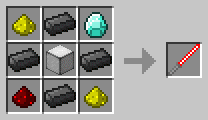

# ToLaserBlade-BTA

[ToLaserBlade](https://github.com/Iunius118/ToLaserBlade) for Better than Adventure!

## Requirements

- Better than Adventure! Babric 1.7.7.0_02 or later
- HalpLibe 2.7.0 or later (usually included in BTA Babric instance)

## Mod Description

### Laser Blade

A sword type item with unlimited durability.

- Item ID: 24530 (default value, configurable in config file)
- Metadata: [0-15] color of laser blade
- Durability: infinite
- Attack damage: 12
- Recipe: 2 glowstone dusts, 4 steel Ingots, 1 diamond, 1 lamp, and 1 redstone.  
Laser Blade items are available in 16 different colors.  

## License

- MIT License

----
Copyright © 2016 Iunius118.
