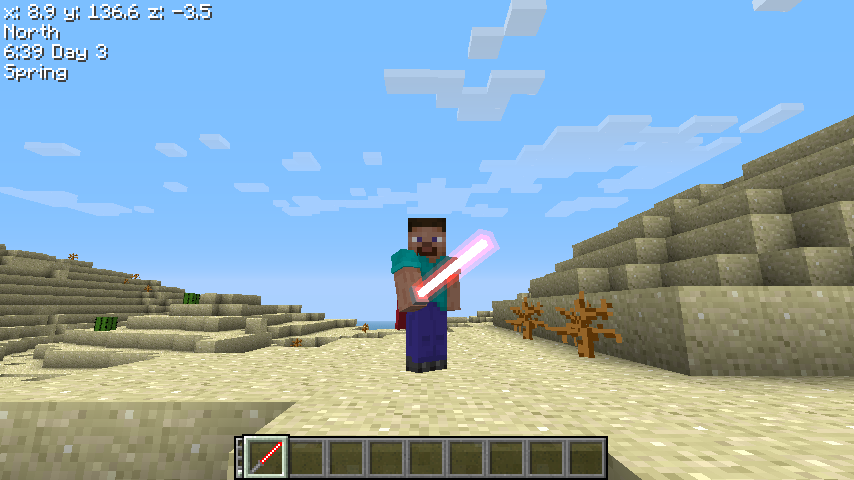
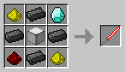

# ToLaserBlade-BTA

[ToLaserBlade](https://github.com/Iunius118/ToLaserBlade) for Better than Adventure!

## Download

- [Modrinth](https://modrinth.com/mod/tolaserblade/versions?s=true&g=b1.7.3)
- [CurseForge](https://www.curseforge.com/minecraft/mc-mods/tolaserblade-fabric/files/all?version=Beta+1.7.3)

## Requirements

- Better than Adventure! Fabric 8.0.1
- HalpLibe 6.2.0+8.0.1 (usually included in BTA Fabric instance)

## Mod Description

### Laser Blade

A sword type item with unlimited durability.

- Item ID: 24530 (default value, configurable in config file)
- Metadata: [0-15] Color of laser blade
- Durability: Infinite
- Attack Damage: 12
- Recipe: 2 glowstone dusts, 4 steel Ingots, 1 diamond, 1 lamp of any color, and 1 redstone.  
Laser Blade items are available in 16 different colors.  

## License

This project is licensed under the MIT license.
